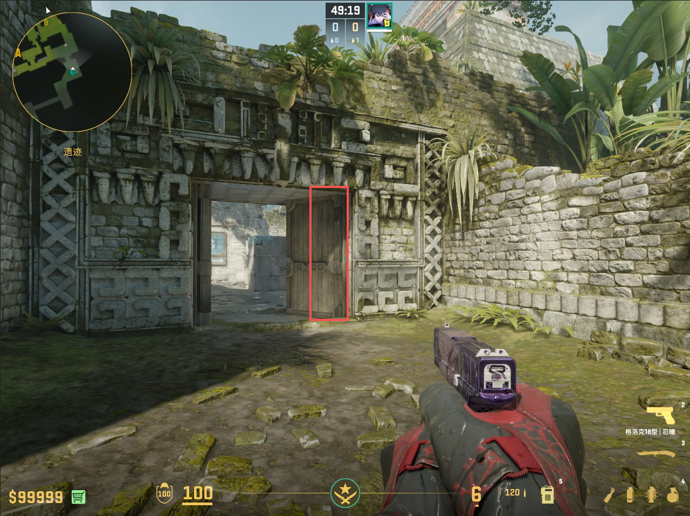
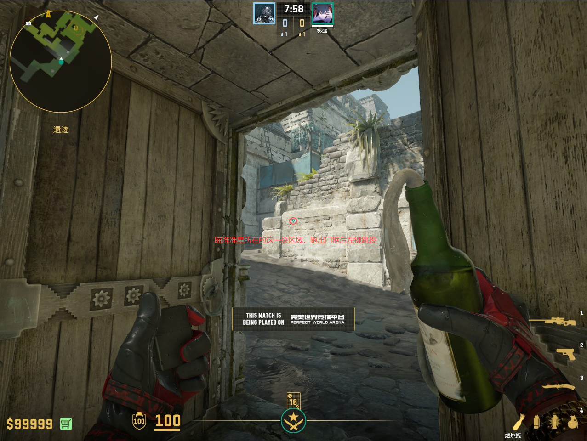
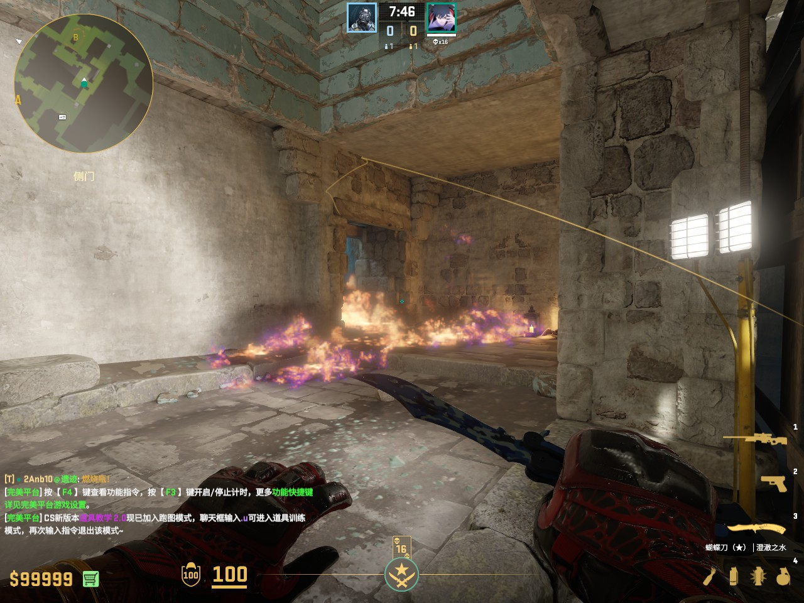
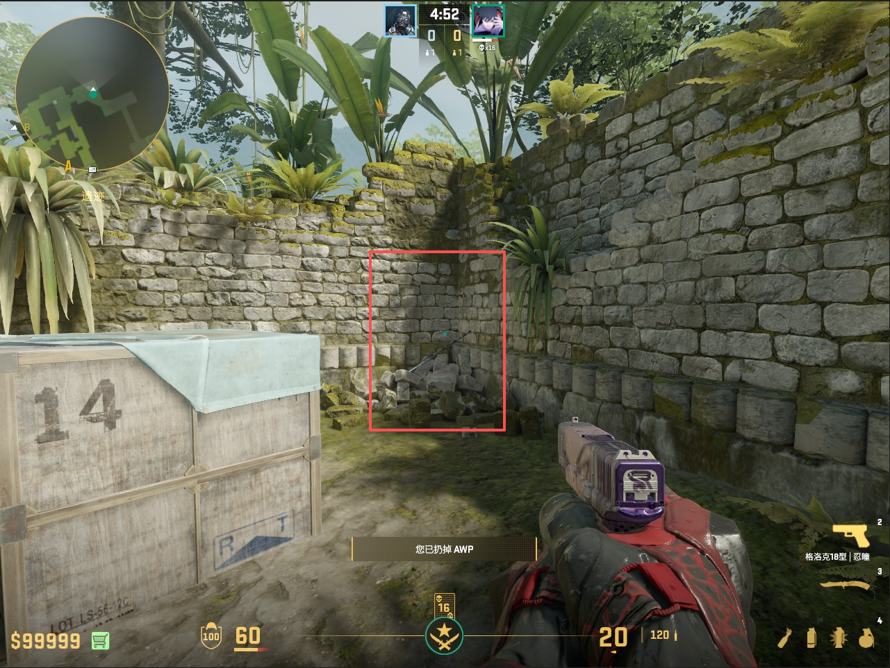
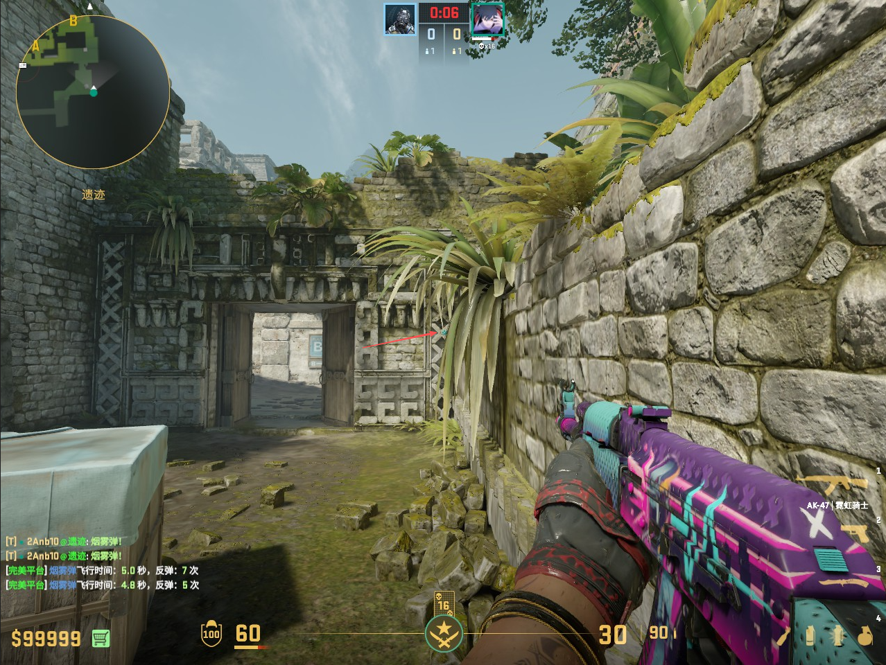
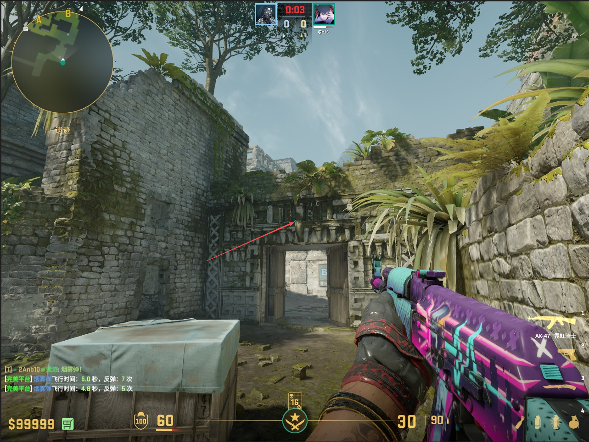
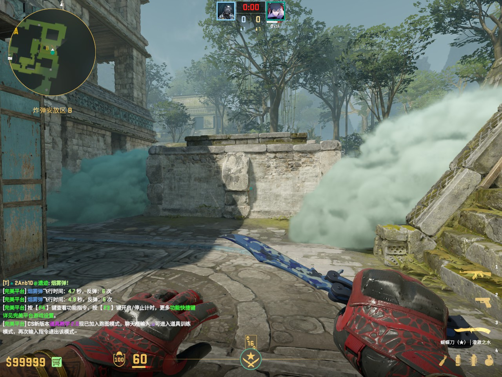

# 匪口抢黑屋

## 宝蓝火

第一步：抵住右边的门口，掏出燃烧瓶

第二步：瞄准点位，跑出门框后**左键跳投**，在跑动过程中准星要一直放在原本瞄的点位，鼠标微调。

**效果图**

# B区爆弹

## 二道烟

第一步：抵住墙角。

第二步：瞄准点位(在这个X砖头的中心偏右)，左键跳投。

## 一道烟

在同样的墙角，瞄准门沿上，中间横梁与中间柱子的左下交汇处，左键跳投一道烟。

**效果图**

